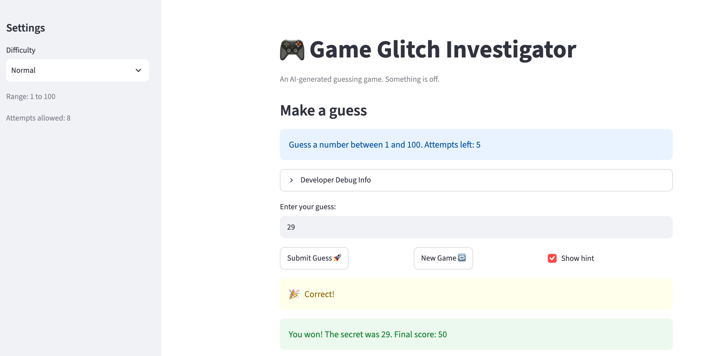

# 🎮 Game Glitch Investigator: The Impossible Guesser

## 🚨 The Situation

You asked an AI to build a simple "Number Guessing Game" using Streamlit.
It wrote the code, ran away, and now the game is unplayable. 

- You can't win.
- The hints lie to you.
- The secret number seems to have commitment issues.

## 🛠️ Setup

1. Install dependencies: `pip install -r requirements.txt`
2. Run the broken app: `python -m streamlit run app.py`

## 🕵️‍♂️ Your Mission

1. **Play the game.** Open the "Developer Debug Info" tab in the app to see the secret number. Try to win.
2. **Find the State Bug.** Why does the secret number change every time you click "Submit"? Ask ChatGPT: *"How do I keep a variable from resetting in Streamlit when I click a button?"*
3. **Fix the Logic.** The hints ("Higher/Lower") are wrong. Fix them.
4. **Refactor & Test.** - Move the logic into `logic_utils.py`.
   - Run `pytest` in your terminal.
   - Keep fixing until all tests pass!

## 📝 Document Your Experience

- [ ] Describe the game's purpose.
Game Glitch Investigator is a Streamlit number-guessing game. The app picks a secret number within a range set by the difficulty (Easy 1–20, Normal 1–100, Hard 1–50). The player has a limited number of attempts to guess it. After each guess they get a "Go HIGHER / Go LOWER" hint and gain or lose points.


- [ ] Detail which bugs you found.
1. The game said "Go higher" when the guess was too high, and "Go lower" when it was too low.
2. On even-numbered attempts `app.py` passes the secret as a `str`, so comparisons were alphabetical (for example, 9 vs "10" was treated as too high).
3. Guesses like `1500` or `-5` were accepted and given a normal hint instead of being rejected.
4. The previous guess stayed in the text box.
5. After a win or loss, the status stays "won"/"lost", so a new game can't start. It also ignores the difficulty range (always 1–100).
6. Hard (1–50) has a smaller range than Normal (1–100), so it is easier, not harder.

- [ ] Explain what fixes you applied.
- **Hints:** moved `check_guess` into `logic_utils.py` and corrected the direction. A guess above the secret returns "Too High / Go LOWER", and a guess below returns "Too Low / Go HIGHER".
- **Type mismatch:** `check_guess` now falls back to comparing `int(guess)` with `int(secret)` when the types are mixed, so hints are always numeric.
- **Range validation:** `parse_guess(raw, low, high)` rejects out-of-range, negative, non-numeric, and empty input with a message such as "Guess must be between 1 and 20". The app passes it the current difficulty's range.
- **Tests:** added regression tests in `tests/test_game_logic.py` for hint direction, string secrets, range boundaries, and per-difficulty ranges.


## 📸 Demo Walkthrough

Describe your fixed game in numbered steps so a reader can follow along without watching a video:

1. User enters a guess of 40 and the secret is 55
2. Game returns "Go HIGHER!" (Too Low)
3. User enters a guess of 70, and the game shows "Go LOWER!" (Too High)
4. User enters a guess of 1500, and the game rejects it as out of range
5. Game ends after the correct guess of 55


**Screenshot** *(optional)*: 




## 🧪 Test Results

```
# pytest tests/
# ========================= 14 passed in 0.04s =========================
```

## 🚀 Stretch Features

- [ ] [If you choose to complete Challenge 4, describe the Enhanced UI changes here — a screenshot is optional]
